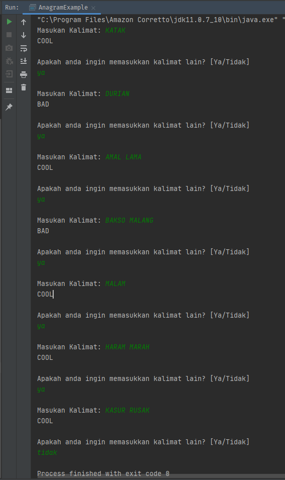

# Words of Anagram

##### Introduction to programming
#### Repetition and Jump Operation (OL) #3

```java
package bol;

import java.util.Scanner;

public class AnagramExample {
    public static void main(String[] args) {

        while (true) { // loop true until break
            Scanner input = new Scanner(System.in); // scanner declaration

            try {
                // Asking user to input a word or words
                System.out.print("Masukan Kalimat: ");
                String words = input.nextLine();

                // check if word or words is anagram
                boolean isAnagram = CheckAnagram(words);

                // Print result
                System.out.println((isAnagram) ? "COOL" : "BAD");

                // Ask to play again?
                System.out.println("\nApakah anda ingin memasukkan kalimat lain? [Ya/Tidak]");
                String answer = input.next();

                // check if user answer != "Ya" then break
                if (!answer.equalsIgnoreCase("Ya")) {
                    break;
                }
                System.out.println();

            } catch (Exception e) {
                System.out.println("Kesalahan pada input, silahkan coba lagi lain waktu. ");
                break;
            }
        }
    }

    private static boolean CheckAnagram(String words) {
        // variable for reverse words
        String reversedWords = "";

        // Loop from the last char of words to the first
        for (int i = words.length() - 1; i >= 0; i--)
            reversedWords = String.format("%s%s", reversedWords, words.charAt(i));

        // return if words is anagram or not
        return words.equals(reversedWords);
    }
}

```
*Sample*  

